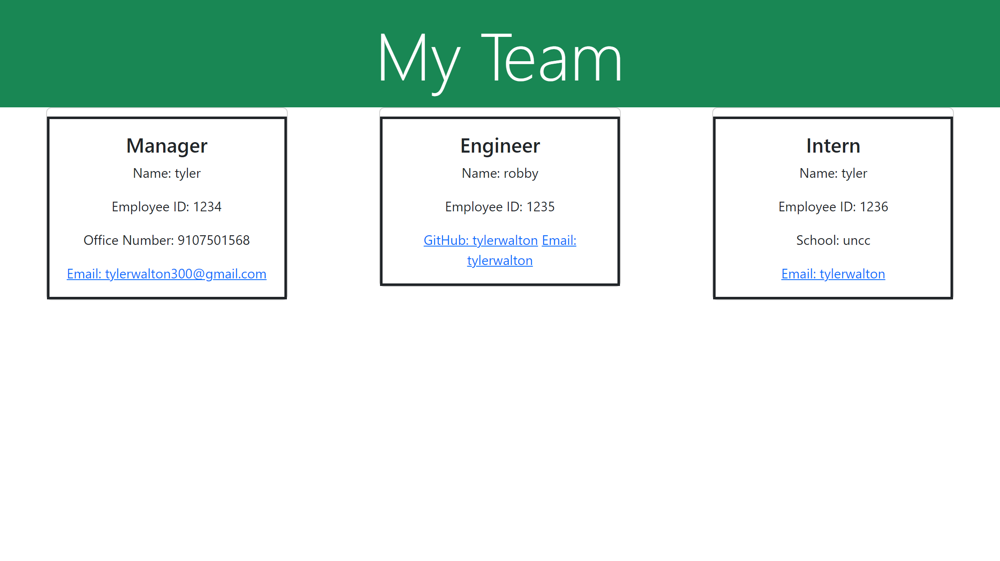

# <u>**Week 10 Challenge**</u>
This weeks challenge focused on being able to use node.js to be able to create a command line app that will allow you to create a professional README.

## <u>**Motivation**</u>
Here is a list of my motivations for this project!

- learn how to properly use Node.js for generating a readme through command line operation
- utilizing template literals to interpolate variables into strings
- lastly, I wanted to create a fully functioning team member generator that myself and anyone I know can use to effortlessly create a page with their team represented on it.

## <u>**Screenshots**</u>

## <u>**Recording**</u>

## <u>**Author**</u>

Tyler Walton  
Tylerwalton300@gmail.com
